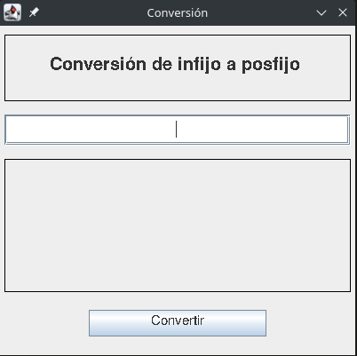

# Conversión Infijo-Posfijo

Programa para hacer conversiones entre notaciones haciendo uso de pilas (estructuras de datos) 

## Autores:

- Miguel Angel Rico Garcia
- Sergio David Paez Suarez

## Interfaz 

